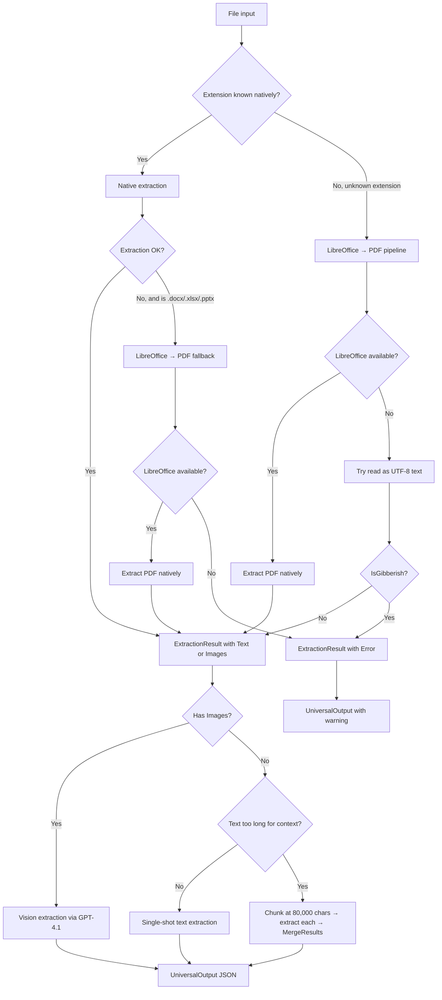

# OmniExtract — Architecture

---

## Project Structure

OmniExtract is a .NET 8 solution with three projects:

```
OmniExtract/
├── OmniExtract.Core/          # Shared models and config
│   ├── Models/
│   │   ├── UniversalOutput.cs     # Extraction output schema
│   │   ├── ExtractionResult.cs    # Internal pipeline contract
│   │   ├── GptMessage.cs          # AI message types
│   │   └── OutputMeta.cs          # Metadata fields
│   └── Config/
│       └── AppSettings.cs         # OpenAISettings, ProcessingSettings, PathSettings
│
├── OmniExtract.App/           # CLI entry point + all services
│   ├── Program.cs                 # CLI: single file, folder, watch mode
│   └── Services/
│       ├── DocumentProcessor.cs   # Format detection and text/image extraction
│       ├── ExtractionService.cs   # AI extraction pipeline (text + vision)
│       ├── GptClient.cs           # Copilot SDK wrapper with retry logic
│       ├── LibreOfficeBridge.cs   # LibreOffice headless conversion
│       ├── ArchiveHandler.cs      # ZIP recursive extraction
│       ├── OutputWriter.cs        # JSON output writer (CLI)
│       └── TokenCounter.cs        # Token estimation for chunking
│
└── OmniExtract.Web/           # Blazor Server web UI
    ├── Components/Pages/
    │   ├── Upload.razor           # Drag-and-drop upload + live queue
    │   ├── Results.razor          # Results grid with filtering
    │   └── ResultDetail.razor     # Extraction detail, rating, export
    └── Services/
        ├── ExtractionOrchestrator.cs  # Web-side job queue
        ├── ResultsRepository.cs       # In-memory result store
        └── ExportService.cs           # JSON/CSV export builder
```

**Responsibilities:**
- **Core** — shared types only; no logic, no I/O. Both App and Web depend on it.
- **App** — all extraction logic. Can run standalone as a CLI or be consumed by Web.
- **Web** — Blazor Server UI. Delegates extraction to the same services used by the CLI.

---

## Extraction Pipeline

The pipeline runs per-file through `DocumentProcessor` then `ExtractionService`.



**Key decisions in the pipeline:**

- **Native-first**: `DocumentProcessor` tries its own parsers (PdfPig, ClosedXML, OpenXml SDK, MimeKit) before touching LibreOffice.
- **Gibberish detection**: PDF text is validated before trusting it. If the character distribution indicates non-text (encoded binary, damaged PDF), it falls back to rendering pages as images.
- **Vision fallback**: When `ExtractionResult.Images` is non-empty, `ExtractionService` sends them to GPT-4.1 vision instead of the text path.

---

## AI Backend

OmniExtract uses **GitHub Copilot SDK** (`GitHub.Copilot.SDK`) rather than a direct OpenAI API key. The `CopilotClient` authenticates using the local Copilot CLI session — no `GITHUB_TOKEN` is required at runtime beyond the Copilot auth.

**`GptClient` features:**

| Feature | Detail |
|---|---|
| Retry logic | Up to 5 attempts; rate-limit errors back off with `min(30 × attempt, 60)` second waits |
| Timeout | 120 seconds per call |
| Concurrency | Controlled by `ProcessingSettings.ApiConcurrency` (default: 2) via `SemaphoreSlim` |
| Context limit error | Detected and triggers chunked extraction |
| Model override | Per-call model parameter; defaults to `OpenAISettings.Model` (`gpt-4.1`) |

**Text model vs. Vision model:**

- `OpenAISettings.Model` (default: `gpt-4.1`) — used for text-based extraction
- `OpenAISettings.VisionModel` (default: `gpt-4.1`) — used for image/scanned-PDF extraction

Both default to `gpt-4.1`. They can be set independently in `appsettings.json` if Copilot makes different model versions available.

---

## Chunking and Merging

When a document's text exceeds the model context window, `ExtractionService` splits it:

- **Chunk size**: 80,000 characters (conservative; accounts for tokeniser overhead vs. the 128,000-token context limit)
- Each chunk is sent as a separate AI call with a `[Chunk N of M]` prefix
- If a chunk still exceeds the context limit at runtime, it is halved recursively until it fits
- Vision chunks default to 6 pages per call (`ProcessingSettings.VisionChunkSize`)

**`MergeResults(List<UniversalOutput>)`** combines multiple chunk results:

- `data` — keys from all chunks merged into a single dictionary (later chunks win on key collision)
- `tables` — concatenated across all chunks
- `tags` — union of all tag lists (deduplicated)
- `meta.confidence` — average across chunks
- `meta.warnings` — concatenated

---

## Storage

**CLI:** `OutputWriter` writes `<sourcepath>.json` alongside each input file. Example: processing `/inbox/contract.pdf` produces `/inbox/contract.pdf.json`. Existing output is overwritten.

**Web UI:** `ResultsRepository` is a singleton in-memory store. Extractions are added via `ResultsRepository.Add()` on job completion. Ratings and failed-job entries also live here. **All data is lost on server restart** — this is by design for the POC.
